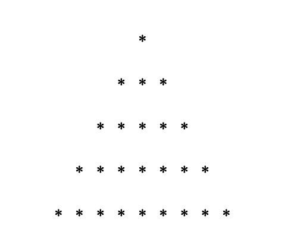

# 程式識讀題目（APCS 2025/09 範例）

來源：APCS 程式識讀題目範例（Python 題本），[原始 PDF](https://apcs.csie.ntnu.edu.tw/wp-content/uploads/2025/09/%E7%A8%8B%E5%BC%8F%E8%AD%98%E8%AE%80_%E9%A1%8C%E7%9B%AE%E7%AF%84%E4%BE%8B_Python%E9%A1%8C%E6%9C%AC_0915.pdf)。

以下整理自 PDF，供 Notebook 練習與註記使用。

## 題目 1

給定右側函式 f( ) ，當執行 f(10) 時，最終回傳結果為何？
- (A) 1
- (B) 3840
- (C) -3840
- (D) 執行時導致無窮迴圈，不會停止執行
```python
def f(i):
    if i > 0:
        if (i // 2) % 2 == 0:
            return f(i - 2) * i
        return f(i - 2) * (-i)
    else:
        return 1
```

## 題目 2

給定右側程式，若已知輸出的結果 為 [1][2][3][5][4][6]， 程 式 中的 (?) 應為下列何者？
```python
for i in range(5):
    j = 0
    while   (?):
        print(f'[{i + j}]', end = '')
        j = j + 2
```
- (A) j<i
- (B) j>i
- (C) j<=i
- (D) j>=i

## 題目 3

給定右側函式 ，已知 f( ) 分別回傳 25、18、10， f(14) 、 、 f(10) 函式中的 (?) 應為下列何者？ f(6)
- (A) (n+1)//2
- (B) n//2
- (C) (n-1)//2
- (D) (n//2)+1
```python
def f(n):
    if n < 2:
        return n
    else:
        return n + f(_(?)_)
```

## 題目 4

給定右側程式片段，當程式執行完後， 輸出結果為何？
- (A) 9
- (B) 18
- (C) 27
- (D) 30

```python
Q = [0] * 200
val = 0
count = 0
head = tail = 0
for i in range(1, 31):
    Q[tail] = i
    tail = tail + 1
while tail > head + 1:
    val = Q[head]
    head = head + 1
    count = count + 1
    if count == 3:
        count = 0
        Q[tail] = val
        tail = tail + 1
print(Q[head])
```

```python
k = 4
m = 1
3 for i in range(5):
```
```python
print(' ' * k, end = '')
print('*' * m)
k = k - 1
m = m + 1
```

## 題目 5

右側程式正確的輸出應該如下：




在不修改右側程式之第 4 行及第 5 行程式碼的前提下，最少需修 改幾行程式碼以得到正確輸出？
- (A) 1
- (B) 2
- (C) 3
- (D) 4


## 題目 6

給定一整數列表 a[0]、a[1]、…、a[99]且 a[k]=3k+1，以 value=100 呼叫以下兩函式， 假設函式 f1 及 f2 之 while 迴圈主體分別執行 n1 與 n2 次（也就是說計算 if 敘述 執行次數，不包含 elif 敘述），請問 n1 與 n2 之值為何? 註： (low + high) // 2 只取整數部分。

```python
def f1(a, value):
    r_value = -1
    i = 0
    while i < 100:
        n1 += 1
        if a[i] == value:
            r_value = i
            break
        i = i + 1
    return r_value
``` 
```python
def f2(a, value):
    r_value = -1
    low = 0
    high = 99
    while low <= high:
        
        n2 += 1
        mid = (low + high) // 2
        if a[mid] == value:
            r_value = mid
            break
        elif a[mid] < value:
            low = mid + 1
        else:
            high = mid - 1
    return r_value
```
- (A) n1=33, n2=4
- (B) n1=33, n2=5
- (C) n1=34, n2=4
- (D) n1=34, n2=5

## 題目 7

一個費式數列定義第一個數為 0，第二個數 為 1，之後的每個數都等於前兩個數相加，如下所示：

0、1、1、2、3、5、8、13、21、34、55、 89…。右列的程式用以計算並印出第 N 個 (N≥2)費式數列的數值，請問 (a) 與 (b) 兩個空格的敘述（statement）應該為何？
```python


a = 0
b = 1

for i in range(2, N + 1):

    temp = b
    # (a)

    a = temp
print(  (b)  )
```
- (A) (a) f[i] = f[i-1]+f[i-2] ------(b) f[N]
- (B) (a) a = a+b -------------- (b) a
- (C) (a) b = a+b -------------- (b) a
- (D) (a) f[i] = f[i-1]+f[i-2] ------  (b)f[i]

## 題目 8

給定右側函式 f1( ) 及 f2( ) 。 f1(1) 運算過程中，以下敘述何者為錯？
- (A) 印出的數字最大的是 4 
- (B) f1 一共被呼叫二次
- (C) f2 一共被呼叫三次
- (D) 數字 2 被印出兩次

```python
def f1(m):
    if m > 3:
        print(m)
        return
    else:
        print(m)
        f2(m + 2)
        print(m)

def f2(n):
    if n > 3:
        print(n)
        return
    else:
        print(n)
        f1(n - 1)
        print(n)
```


## 題目 9

右側程式片段擬以輾轉除法求 i 與 j 的最大公因數。請問 while 迴圈內容何者正確？ 


```python
i = 76
j = 48
while (i % j) != 0:

# ____________
# ____________ 
# ____________

print (j)
```


- (A) 
```python
k = i % j 
i = j
j = k
```
- (B) 
```python
i = j 
j = k
k = i % j
```
- (C) 
```python
i = j 
j = i % k
k = i
```
- (D) 
```python
k = i
i = j
j = i % k
```

## 題目 10

右側程式執行過後所輸出數值為何？

- (A) 11
- (B) 13
- (C) 15
- (D) 16
```python
count = 10
if count > 0:
    count = 11
if count > 10:
    count = 12
    if count % 3 == 4:
        count = 1
    else:
        count = 0
elif count > 11:
    count = 13
else:
    count = 14
if count:
    count = 15
else:
    count = 16
print(count)
```

## 題目 11

右側為一個計算 n 階乘的函式，請問 該如何修改才會得到正確的結果？ 1. def fun (n):

2. 3. 4.
```python
fac = 1
if n >= 0:
fac = n * fun(n - 1)
``` 5.
```python
return fac
```
- (A) 第 2 行，改為
```python
fac = n
```
- (B) 第 3 行，改為 if n > 0:
- (C) 第 4 行，改為
```python
fac = n * fun(n+1)
```
- (D) 第 4 行，改為 fac = fac * fun(n-1)
```python
def f(n):
p = 0
i = n
while i >=     (a):
p = 10 -   (b)   * i
print (p, end = '')
i = i -     (c)
```

## 題目 12

右側 f( ) 函式 (a), (b), (c) 處需 輸 分別填入哪些數字，方能使得 f(4) 出 2468 的結果？
- (A) 1, 2, 1
- (B) 0, 1, 2
- (C) 0, 2, 1
- (D) 1, 1, 1

## 題目 13

右側 g(4) 函式呼叫執行後，回傳值為何？
- (A) 6
- (B) 11
- (C) 13
- (D) 14

```python
def f(n):
    if n > 3:
        return 1
    elif n == 2:
        return 3 + f(n + 1)
    else:
        return 1 + f(n + 1)
def g(n):
    j = 0
    for i in range(1, n):
        j = j + f(i)
    return j
def Mystery (x):
if x <= 1:
return  x
else:
``` return

## 題目 14

右側 Mystery( ) 函式 else 部 分 運 算 式 應 為 何 ， 才 能 使 得
```python
Mystery(9)
``` 的回傳值為 34 。
- (A) x + Mystery(x-1)
- (B) x * Mystery(x-1)
- (C) Mystery(x-2) + Mystery(x+2)
- (D) Mystery(x-2) + Mystery(x-1)

## 題目 15

右側程式碼執 行 後， 輸 出 結 果 為何？
```python
a = [1, 3, 5, 7, 9, 8, 6, 4, 2]
n = 9
```
- (A) 2 4 6 8 9 7 5 3 1 9
```python
for i in range(n):
```
- (B) 1 3 5 7 9 2 4 6 8 9 a[i], a[n-i-1] = a[n-i-1], a[i]
- (C) 1 2 3 4 5 6 7 8 9 9
```python
for i in range(n//2 + 1):
```
- (D) 2 4 6 8 5 1 3 7 9 9
```python
    print(a[i], a[n-i-1], end = ' ')
```

## 題目 16

右側函式以 F(7) 呼叫後回傳值為 12，則 <condition> 應為何？
```python
def F(a):
```
- (A) a < 3
- (B) a < 2
- (C) a < 1
- (D) a < 0
```python
if  <condition>:
return 1
else:
return F(a-2) + F(a-3)
```

```python
if s>=90:
    print('A')
elif s>=80:
    print('B')
elif s>60:
    print('D')
elif s>70:
    print('C')
else:
    print('F')
```

## 題目 17

右側是依據分數 s 的等第公式應為： 評定等第的程式碼片段，正確 90~100 判為 A 等 80~89 判為 B 等 70~79 判為 C 等 60~69 判為 D 等 0~59 判為 F 等 這段程式碼在處理 0~100 的分數時，有幾個分數的 等第是錯的？
- (A) 20
- (B) 11
- (C) 2
- (D) 10

## 題目 18

右 側 程 式 片 段 執 行後，
```python
count
``` 的值為何？
- (A) 36
- (B) 20
- (C) 12
- (D) 3
```python
maze = [[1, 1, 1, 1, 1],
``` [1, 0, 1, 0, 1], [1, 1, 0, 0, 1], [1, 0, 0, 1, 1], [1, 1, 1, 1, 1]]
```python
count = 0
for i in range(1, 4):
    for j in range(1, 4):
        dir = [[-1,0], [0,1], [1,0], [0,-1]]
        for d in range(4):
            if maze[i+dir[d][0]][j+dir[d][1]]==1:
                count = count + 1
```

## 題目 19

右側程式片段中執行後若要 印出下列圖案， (a) 的條件
```python
for i in range(4):
``` 判斷式該如何設定？
```python
    for j in range(i):
        print(' ', end = '')
    for k in range(6-2*i,   (a)  , -1):
        print('*', end = '')
    print('')
```
* * * * * *
* * * *
* *
- (A) 2
- (B) 1
- (C) 0
- (D) －1

## 題目 20

下列程式碼是自動計算找零程式的一部分，程式碼中三個主要變數分別 為
```python
Change (找零金額)。但是此程式片
``` Total (購買總額)， 段有冗餘的程式碼，也就是移除該段程式碼之後不會影響程式的功能。請找出冗 Paid (實際支付金額)， 餘程式碼的區塊。
- (A) 冗餘程式碼在 A 區
- (B) 冗餘程式碼在 B 區
- (C) 冗餘程式碼在 C 區
- (D) 冗餘程式碼在 D 區
```python
Change = Paid - Total
print (f'500 : {(Change-Change%500)//500} pieces')
Change = Change % 500
print (f'100 : {(Change-Change%100)//100} coins')
Change = Change % 100
# A 區
print (f'50 : {(Change-Change%50)//50} coins')
Change = Change % 50
# B 區
print (f'10 : {(Change-Change%10)//10} coins')
Change = Change % 10
# C 區
print (f'5 : {(Change-Change%5)//5} coins')
Change = Change % 5
# D 區
print (f'1 : {(Change-Change%1)//1} coins')
Change = Change % 1
```

```python
def G(a, x):
    if x == 0:
        return 1
    else:
        return a * G(a, x - 1)
A = [0, 2, 4, 6, 8, 10, 12, 14]
def Search(x):
    high = 7
    low = 0
    while high > low:
        mid = (high + low) // 2
        if A[mid] <= x:
            low = mid + 1
        else:
            high = mid
    return A[high]
```

## 題目 21

右側 G()
```python
G(3, 7)
``` 為遞迴函式， 執行後回傳值為何？
- (A) 128
- (B) 2187
- (C) 6561
- (D) 1024

## 題目 22

給定一個 1x8 的列表 A ， A = [0, 。右側函 2, 4, 6, 8, 10, 12, 14] 式 真正目的是找到
```python
Search(x)
``` 之中 A 大於 的最小值。然而，這個函式有 x 誤。請問下列哪個函式呼叫可測出函 式有誤？
- (A) Search(-1)
- (B) Search(0)
- (C) Search(10)
- (D) Search(16)

## 題目 23

右側函式兩個回傳式分別該如何撰寫，才 能正確計算並回傳兩參數 a, b 之最大公
```python
def GCD(a, b):
``` 因數 (Greatest Common Divisor)？
```python
    r = a % b
```
- (A) a, GCD(b,r)
- (B) b, GCD(b,r)
- (C) a, GCD(a,r)
- (D) b, GCD(a,r)
```python
    if r == 0:
        return
    return
A = […]
p = q = A[0]
for i in range(1, n):
    if A[i] > p:
        p = A[i]
    if A[i] < q:
        q = A[i]
```

## 題目 24

若 A 是一個可儲存 n 筆整數的列表，且資 。經過右側程式碼 料儲存於 A[0]~A[n-1] 運算後，以下何者敘述不一定正確？ 列表資料中的最大值 列表資料中的最小值 是 A
- (A) p 是 A
- (B) q
- (C) q < p
- (D) A[0] <= p

## 題目 25

右側
```python
F(  )
``` 函式執行時，若輸入依 序為整數 0, 1, 2, 3, 4, 5, 6, 7, 8, 9，
```python
def F( ):
``` 請問 X 列表的元素值依順序為何？
```python
    X = [0] * 10
    for i in range(10):
``` X[(i+2)%10] = int(input())
- (A) 0, 1, 2, 3, 4, 5, 6, 7, 8, 9
- (B) 2, 0, 2, 0, 2, 0, 2, 0, 2, 0
- (C) 9, 0, 1, 2, 3, 4, 5, 6, 7, 8
- (D) 8, 9, 0, 1, 2, 3, 4, 5, 6, 7

## 題目 26

右側程式片段無法正確列印 20 次的 "Hi!"，請問下列哪一個修正方式仍無
```python
for i in range(0, 101, 5):
``` 法正確列印 20 次的"Hi!"？
```python
    print('Hi!')
```
- (A) 將
```python
range(0, 101, 5)
``` 改為
```python
range(0, 20, 1)
```
- (B) 將
```python
range(0, 101, 5)
``` 改為
```python
range(5, 101, 5)
```
- (C) 將
```python
range(0, 101, 5)
改為 range(0, 100, 5)
```
- (D) 將
```python
range(0, 101, 5)
``` 改為
```python
range(5, 100, 5)
```

## 題目 27

給定右側函式 F( ) ，執行 F( ) 時哪一 行程式碼永遠不會被執行到？
```python
def F(a):
```
- (A) a = a + 5
- (B) a = a + 2
- (C) a = 5
- (D) 每一行都執行得到
```python
    while a < 10:
        a = a + 5
    if a < 12:
        a = a + 2
    if a < 11:
        a = 5
```

## 題目 28

給定右側函式 F( ) 完所回傳的 x 值為何？ ，
```python
F( )
``` 執行 log2 n
- (A) n(n+1)√
- (B) n2(n+1)/2
- (C) n(n+1)[ log2 n + 1]/2
- (D) n(n+1)/2 ⌋ ⌊
```python
def F(n):
    x = 0
    for i in range(1, n+1):
        for j in range(i, n+1):
            k = 1
            while k <= n:
                x = x + 1
                k = k * 2
    return x
```

## 題目 29

右側程式擬找出列表 A 中的最大值 (M)和最小值(N)。不過，這段程式 碼有誤，請問 A 初始值如何設定就 可以測出程式有誤？
```python
M, N, s = -1, 101, 3
A = [80, 90, 100]
```
- (A) [90, 80, 100]
- (B) [80, 90, 100]
- (C) [100, 90, 80]
- (D) [90, 100, 80]
```python
for i in range(s):
    if A[i]>M:
        M = A[i]
    elif A[i]<N:
        N = A[i]
print(f'M = {M}, N = {N}')
```

## 題目 30

經過運算後，右側程式的輸出為何？
- (A) 1275
- (B) 20
- (C) 1000
- (D) 810
```python
a = [0] * 101
b = [i for i in range(101)]
for i in range(1, 101):
    a[i] = b[i] + a[i - 1]
print(a[50] - a[30])
```


## 延伸閱讀

> 「ICPC 2025 全球總決賽誕生歷史性一幕：谷歌 Gemini 與 OpenAI 推理模型同時斬獲金牌；Gemini 在 5 小時內攻下 12 題中的 10 題，30 分鐘破解死亡 C 題；OpenAI 更是滿分 12/12，成為全場唯一全解團隊。」 — 摘自[賽後專文](https://mp.weixin.qq.com/s/qjsW2JDhvKQ5G9cylyDZxw)

- [ICPC 2025 全球總決賽的洛杉磯殿堂瞬間：AI 團隊與人類隊伍的對決](https://mp.weixin.qq.com/s/qjsW2JDhvKQ5G9cylyDZxw) — 包含 Gemini 與 OpenAI 推理模型同場奪金、AI 滿分全解 12 題的賽事分析
